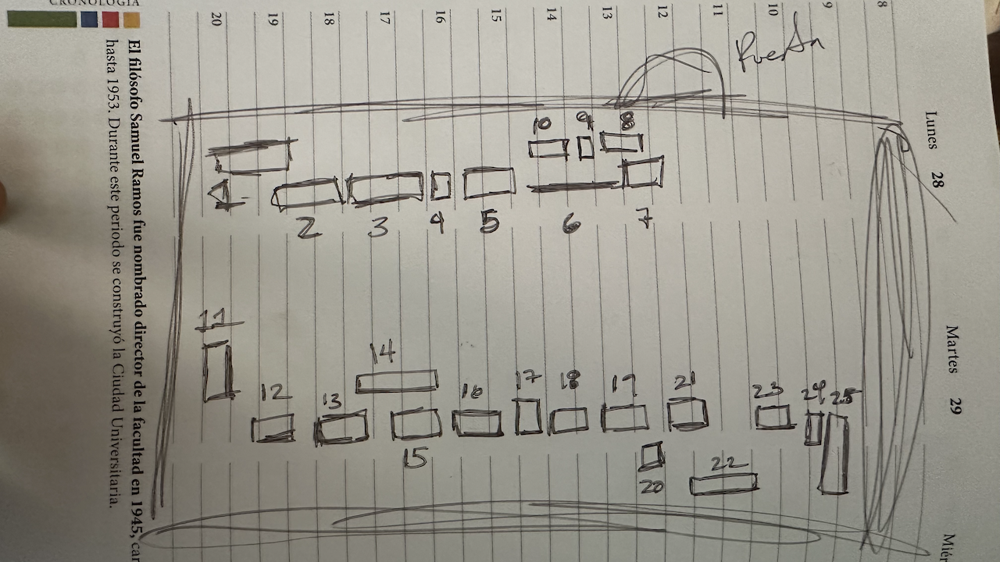

# site-ier

## Equipo de Cómputo del Site

> @Natalia Ananda Ruiz Aguado @Paulina Abril Chávez Reyes  
> Esta es la estructura inicial para recopilar la info del equipo de cómputo del Site.

*(Respaldo de imagen, por si la ruta anterior no existe)*  

---

## Plantilla de tabla (usa esta estructura)

| Descripción | Inventario | Potencia | Comentarios |
| --- | --- | --- | --- |
|  |  |  |  |

---

## Inventario por responsable

### 1. @Guillermo Barrios del Valle

| Descripción | Inventario | Potencia | Comentarios |
| --- | --- | --- | --- |
| Distribuidor de fibra óptica DFO-01 | 02522958 |  | Pedir |
| Distribuidor de fibra óptica DFO-02, reflejo rack 1-6 |  |  | Pedir |
| Extreme Networks X690-48x-2q-4c | 02522954 |  |  |
| Extreme Network C35 | 02522905 |  |  |
| Extreme Networks (sin modelo) | 02522906 |  |  |
| UPS-2 CTO-1 | 02510765 |  |  |
| IERNVR1 (Coordinación de administración de servicios administrativos, UTI) |  |  |  |
| Extreme Network Summit X45-G2-48T-10GE4 | 02522907 |  |  |
| Extreme Networks 08G20G4-48P |  |  |  |
| 110 PSE PowerSun Panel Lucent (Secretaría Académica) |  |  |  |
| Extreme Networks Summit X450-G2-24P-10GE4 | 02522910 |  |  |
| Baseline Switch 2952SFP Plus 3CRBSG5293 |  |  |  |
| SP-R1_P5-D025-D046 |  |  |  |
| UPS-2 / CTO-3 y 4 |  |  |  |
| UPS-1 / CTO-3 y 4 |  |  |  |

---

### 2. @Paulina Abril Chávez Reyes

| Descripción | Inventario | Potencia | Comentarios |
| --- | --- | --- | --- |
| System X 3250 M6 | 02522955 |  |  |
| System X 3250 M6 | 02522956 |  |  |
| System X 3250 M6 | 02522957 |  |  |
| TeraStation Buffalo | 02526454 |  |  |
| UPS SRT1500XLA |  |  |  |
| Monitor LG FLATRON W193451 |  |  |  |

---

### 3. @Natalia Ananda Ruiz Aguado

| Descripción | Inventario | Potencia | Comentarios |
| --- | --- | --- | --- |
| TYAN-MITAC Computing Technology Corp, Model: GT29E-B7106 |  | 650 W RPSU, 80 PLUS Platinum |  |
| (sin descripción) | 03003170 |  | Pedir |
| EXXACT |  |  | Pedir |
| EXXACT |  |  | Pedir |
| NODE 0-15 |  |  | Pedir |
| NODE 0-14 |  |  | Pedir |
| COMPUTE 0-12 |  |  | Pedir |
| NODE 0-6 GPU (Marca: Num) |  |  | Pedir |
| Rackmount console Tripp-Lite Model: B021-000-17 |  | 30 W |  |
| MASTER SUPERMICR |  |  | Pedir |
| STORAGE SUPERMICR |  |  | Pedir |
| QLOGIC 12300 InfiniBand Switch |  | 85–226 W |  |
| TYAN Product Server, Model: GT24E-B7106 (EXXACT) |  | 650 W (máxima fuente) | ×3 |
| TYAN Server, Model: GT24E-B7106 (EXXACT) | 02554333 | 650 W (máxima fuente) | ×3 |
| APC RBC interna |  |  | Pedir |

---

### 4. @Paulina Abril Chávez Reyes

| Descripción | Inventario | Potencia | Comentarios |
| --- | --- | --- | --- |
| APC (MaxOutput 200/208/220/240) | 02502109 |  |  |
| Batería gris APCRBC140 (5A2333T56032) |  |  |  |

---

### 5. @Paulina Abril Chávez Reyes

| Descripción | Inventario | Potencia | Comentarios |
| --- | --- | --- | --- |
| SUPERMICRO [SIM 02, SIM 03] | 02452117 |  |  |
| DELL PowerEdge R710 [Maxtla] |  |  |  |
| DELL PowerEdge R620 [Mazatl Srv1] | 02366402 |  |  |
| DELL PowerEdge R620 [Srv2] | 02366403 |  |  |
| DELL PowerEdge R430 (Vms-server) |  |  |  |
| TrippLite B042-008 KVM Switch |  |  |  |
| DVD-ROM [SIM 04] | 02463091 |  |  |
| SUPERMICRO [SIJTLI] | 02473078 |  |  |
| DELL PowerEdge R220 [KYLOREN] |  |  |  |
| DVD-ROM [K8S JUPYTER] | 02477580 |  |  |
| SUPERMICRO [CIHUACOATL] |  |  |  |
| ExtremeSummit X4450-G2-48T-10GE4 | 02522909 |  |  |
| Extreme Networks (10.10.5.22) |  |  |  |
| TrippLite Rackmount B021-000-17 Console | 02371793 |  |  |
| Compact Disc Rewritable [MICHIH] | 02377106 |  |  |
| Enterasys [Netsight] |  |  |  |
| DELL PowerVault MD1220 [lo usa Srv 02] |  |  |  |
| DELL ST: FV45P22 [Slade-03] | 02432918 |  |  |
| ¿? [SIM 01] | 02502110 |  |  |
| DELL PowerEdge R420 [Dr. Octavio] | 02415445 |  |  |
| UPS DELL 1 | 02366404 |  |  |
| UPS DELL 2 | 02366405 |  |  |

---

### 6. @Natalia Ananda Ruiz Aguado

| Descripción | Inventario | Potencia | Comentarios |
| --- | --- | --- | --- |
| AC LINE |  |  | Pedir. Códigos de barras observados: D884662F4251-85, 15150550915M |
| Tripp-Lite 8-Port KVM Switch |  | 34 W | [Ficha técnica](https://assets.tripplite.com/product-pdfs/es/b04000819.pdf) |
| (sin descripción) | 02290416 |  | Pedir |
| (sin descripción) | 02526382 |  | Pedir |
| ViewSonic |  |  | Pedir. *Es una computadora* |
| HP (Product No. E2A8SLT#ABM, Serial No. 2UA3321044) |  | 320 W |  |
| (sin descripción) | 02371795 |  | Pedir |
| (sin descripción) | 02418948 |  | Pedir |
| (sin descripción) | 02502160 |  | Pedir |
| (sin descripción) | 02316225 |  | Pedir |
| (sin descripción) | 02343070 |  | Pedir |
| SOLA SB 1405 Micro SR 1600 (Soporte Regulado) |  | 1000 W |  |
| SOLA SB Microsea 1600 (Sistema de energía auxiliar) |  | 1000 W | ×2 |

---

### 7. @Guillermo Barrios del Valle

| Descripción | Inventario | Potencia | Comentarios |
| --- | --- | --- | --- |
| Supermicro | 02554348 |  |  |
| Supermicro | 02554348 |  | ¿Son dos unidades? |
| Tripp-Lite SmartPro UPS | 02554394 |  |  |

---

### 8. @Guillermo Barrios del Valle

| Descripción | Inventario | Potencia | Comentarios |
| --- | --- | --- | --- |
| CPU Dell | 02412057 |  |  |

---

### 9. @Guillermo Barrios del Valle

| Descripción | Inventario | Potencia | Comentarios |
| --- | --- | --- | --- |
| MICRO SR-1600 SOLA-SB |  |  |  |

---

### 10. @Guillermo Barrios del Valle

| Descripción | Inventario | Potencia | Comentarios |
| --- | --- | --- | --- |
|  |  |  |  |

---

### 11. @Guillermo Barrios del Valle

| Descripción | Inventario | Potencia | Comentarios |
| --- | --- | --- | --- |
|  |  |  |  |

---

### 12. @Guillermo Barrios del Valle

| Descripción | Inventario | Potencia | Comentarios |
| --- | --- | --- | --- |
|  |  |  |  |

---

### 13. @Guillermo Barrios del Valle

| Descripción | Inventario | Potencia | Comentarios |
| --- | --- | --- | --- |
|  |  |  |  |

---

### 14. @Natalia Ananda Ruiz Aguado

| Descripción | Inventario | Potencia | Comentarios |
| --- | --- | --- | --- |
| (sin descripción) | 03005844 |  | Pedir |

---

### 15. @Paulina Abril Chávez Reyes *(revisar memo si hizo el 16)*

| Descripción | Inventario | Potencia | Comentarios |
| --- | --- | --- | --- |
| TELMEX Red digital de acceso [UNAM SOLAR MEXFO SERV] |  |  |  |
| FSP 150 CCGE12 PSS |  |  |  |
| Cisco 3925 |  |  |  |
| Coriant 709007CE (11–60 VDC, 1.5 A) |  |  |  |
| HUAWEI EchoLife HG8245Q2 (módem) |  |  |  |
| Cisco 4400 Series ISR 4451-X |  |  |  |

---

### 16. @Guillermo Barrios del Valle *(es el 15 de memo)*

| Descripción | Inventario | Potencia | Comentarios |
| --- | --- | --- | --- |
|  |  |  |  |

---

### 17. @Guillermo Barrios del Valle

| Descripción | Inventario | Potencia | Comentarios |
| --- | --- | --- | --- |
|  |  |  |  |

---

### 18. @Natalia Ananda Ruiz Aguado

| Descripción | Inventario | Potencia | Comentarios |
| --- | --- | --- | --- |
| D-Link Gigabit Switch, Model DGS-10240 |  | 15.2 W |  |
| (sin descripción) | 03004088 |  | Pedir |
| huitzache (EXXACT) |  |  | Pedir |
| ¿? |  |  | Pedir |
| RS2418+ NAS-UC |  | 500 W |  |
| jupyter |  |  | Pedir |
| apatlaco |  |  | Pedir |
| BenQ LCD Monitor GL2460-8 (Type GL2460) |  | 32 W |  |
| Voltaire (¿ventilador?) |  |  | Pedir |
| Supermicr Model: 813M-4 “Master” |  |  | Potencia por confirmar (¿280–600 W?) |
| Supermicr NODE-GPU NODE-0-6 |  |  | Pedir |
| NODE-0-5 |  |  | Pedir |
| NODE-0-0 |  |  | Pedir |
| NODE-0-1 |  |  | Pedir |
| APC Smart-UPS 3000 |  | 2700 W | ×3 — [Referencia](https://www.ienergia.mx/producto/smart-ups-apc-smt3000c/) |

---

### 19. @Guillermo Barrios del Valle

| Descripción | Inventario | Potencia | Comentarios |
| --- | --- | --- | --- |
|  |  |  |  |

---

### 20. @Guillermo Barrios del Valle

| Descripción | Inventario | Potencia | Comentarios |
| --- | --- | --- | --- |
|  |  |  |  |

---

### 21. @Paulina Abril Chávez Reyes

| Descripción | Inventario | Potencia | Comentarios |
| --- | --- | --- | --- |
| UPS Accessory APC SRT5KTF |  |  |  |
| APC UPS [UPS1] |  |  |  |
| APC SRT192BP |  |  |  |
| APC SRT5KTF |  |  |  |
| APC SRT6KXLT [UPS 2] |  |  |  |
| APC SRT192BP |  |  |  |
| ¿? [Rectificador PBX] | 02365719 |  |  |
| POWERWARE PW9125 600G BLK | 02283137 |  |  |
| POWERWARE PW9125 240EBM BLK [UPS 3 6 kVA] |  |  |  |

---

### 22. @Guillermo Barrios del Valle

| Descripción | Inventario | Potencia | Comentarios |
| --- | --- | --- | --- |
|  |  |  |  |

---

### 23. @Guillermo Barrios del Valle

| Descripción | Inventario | Potencia | Comentarios |
| --- | --- | --- | --- |
|  |  |  |  |

---

### 24. @Guillermo Barrios del Valle

| Descripción | Inventario | Potencia | Comentarios |
| --- | --- | --- | --- |
|  |  |  |  |

---

### 25. @Guillermo Barrios del Valle

| Descripción | Inventario | Potencia | Comentarios |
| --- | --- | --- | --- |
|  |  |  |  |
